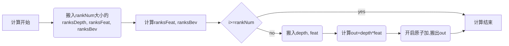

## 从头实现一个自定义算子API
本文将指导你如何从头开始实现一个自定义算子API。我们将实现一个简单的算子，`bev_pool_v3`，与`bev_pool_v2`相似，但是我们不再使用排序算法，并且channel大小整除8。该算子的输入输出如下：
| 名称 | 类型 | Shape | 描述 |
| --- | --- | --- | --- |
|`depth`|`Tensor`|`[B, N, D, H, W]`| 输入，深度图 |
|`feat`|`Tensor`|`[B, N, H, W, C]`| 输入，特征图 |
| `ranks_depth` | `Tensor` | `[N_RNAKS]` | 输入，深度图索引 |
| `ranks_feat` | `Tensor` | `[N_RNAKS]` | 输入，特征图索引 |
|`ranks_bev`|`Tensor`|`[N_RNAKS]`| 输入, BEV索引 |
|`bev_feat_shape`|`List[int]`|`5`| 输入，BEV特征图形状, B, D, H, W, C |
|`out`|`Tensor`|`[B, C, D, H, W]`| 输出，BEV特征图 |

### 1. 厘清算子的计算逻辑
`bev_pool_v3`算子的计算逻辑如下： 每次从深度图中取出一个深度值，然后在特征图中找到对应的特征，相乘，然后将结果累加到BEV特征图中对应的位置。这个过程重复`N_RANKS`次。
我们先用torch实现这个算子，然后再用AscendC实现，这样能更好地理解算子的计算逻辑，并且有助于调试。
```python
import torch
B, N, D, H, W = 2, 3, 4, 5, 6
N_RANKS = 7
C = 8
depth = torch.rand([B, N, D, H, W])
feat = torch.rand([B, N, H, W, C])
ranks_depth = torch.randint(0, B*N*D*H*W, [N_RANKS])
ranks_feat = torch.randint(0, B*N*H*W, [N_RANKS])
ranks_bev = torch.randint(0, B, [N_RANKS])
bev_feat_shape = [B, D, H, W, C]

def bev_pool_v3(depth, feat, ranks_depth, ranks_feat, ranks_bev, bev_feat_shape):
    B, D, H, W, C = bev_feat_shape
    depth = depth.view([B*N*D*H*W])
    feat = feat.view([B*N*H*W, C])
    out = torch.zeros([B, D, H, W, C])
    for i in range(N_RANKS):
        d = depth[ranks_depth[i]]
        f = feat[ranks_feat[i]]
        b = ranks_bev[i]
        out[b] += d * f
```
事实上，我们已经实现了一个简单的`bev_pool_v3`算子，接下来我们把它一步步转换成Driving SDK上的AscendC代码。
### 2. 增加算子Python API
在`mx_driving/point/ops`目录下创建一个新的文件`bev_pool_v3.py`，并添加如下代码：
```python
class BEVPoolV3(torch.autograd.Function):
    @staticmethod
    def forward(ctx, depth, feat, ranks_depth, ranks_feat, ranks_bev, bev_feat_shape):
        (B, D, H, W, C) = bev_feat_shape
        out = mx_driving._C.npu_bev_pool_v3(depth, feat, ranks_depth, ranks_feat, ranks_bev, B, D, H, W)
        return out

def bev_pool_v3(depth, feat, ranks_depth, ranks_feat, ranks_bev, bev_feat_shape):
    x = BEVPoolV3.apply(
        depth,
        feat,
        ranks_depth,
        ranks_feat,
        ranks_bev,
        bev_feat_shape,
    )
    x = x.permute(0, 4, 1, 2, 3).contiguous()
    return x
```
> 注意：我们将转置逻辑放在了`bev_pool_v3`函数中，而非`forward`中，这样我们在backward时，我们就不用手动将梯度再次转置了，降低了思考的复杂度。
### 3. 增加算子C++ ABI
我们首先在`_C.__init__.pyi`中增加`npu_bev_pool_v3`的声明：
```python
def npu_bev_pool_v3(
    depth: torch.Tensor,
    feat: torch.Tensor,
    ranks_depth: torch.Tensor,
    ranks_feat: torch.Tensor,
    ranks_bev: torch.Tensor,
    B: int,
    D: int,
    H: int,
    W: int,
) -> torch.Tensor:...
```
当然，你可以不做这一步，但是这样做有助于你在编写Python代码时，获得更好的代码提示和类型检查体验。
然后在`mx_driving/point/csrc`目录下的`function.h`中增加`npu_bev_pool_v3`的声明：
```cpp
at::Tensor npu_bev_pool_v3(const at::Tensor& depth, const at::Tensor& feat, const at::Tensor& ranks_depth,
    const at::Tensor& ranks_feat, const at::Tensor& ranks_bev, int64_t b, int64_t d, int64_t h, int64_t w);
```
并且在`pybind.cpp`中增加`npu_bev_pool_v3`的绑定：
```cpp
m.def("npu_bev_pool_v3", &npu_bev_pool_v3);
```
### 4. 实现算子C++ ABI
我们再次增加一个新的文件`BEVPoolV3.cpp`，并实现一个返回全0的`npu_bev_pool_v3`函数：
```cpp
#include "csrc/OpApiCommon.h"
#include "functions.h"
at::Tensor npu_bev_pool_v3(const at::Tensor& depth, const at::Tensor& feat, const at::Tensor& ranks_depth,
    const at::Tensor& ranks_feat, const at::Tensor& ranks_bev, int64_t b, int64_t d, int64_t h, int64_t w)
{
    auto c = feat.size(C_IDX);
    auto out = at::zeros({b, d, h, w, c}, feat.options());
    return out;
}
```
然后，执行`python setup.py develp`, 你就可以在Python中使用`bev_pool_v3`算子了。当然，这个算子还没有实现任何功能，接下来我们将逐步完善它。
### 5. 增加AscendC测的算子接口
当我们执行一个NPU算子时，任务经由python到我们的C++ ABI，然后再到NPU的C++ ABI(CANN 运行时)，运行时找到算子的二进制文件，将它加载到硬件上执行，并配置好输入输出。因此我们还需要增加一个运行时能够找到二进制，配置下发计算任务的算子定义接口。
我们在`mx_driving/point/kernels/op_host`下增加一个新的文件`bev_pool_v3.cpp`中增加如下代码：
```cpp
namespace ops {
class BEVPoolV3 : public OpDef {
public:
    explicit BEVPoolV3(const char* name) : OpDef(name)
    {
        this->Input("depth")
            .ParamType(REQUIRED)
            .DataType({ge::DT_FLOAT})
            .Format({ge::FORMAT_ND})
            .AutoContiguous()
            .UnknownShapeFormat({ge::FORMAT_ND});
        this->Input("feat")
            .ParamType(REQUIRED)
            .DataType({ge::DT_FLOAT})
            .Format({ge::FORMAT_ND})
            .AutoContiguous()
            .UnknownShapeFormat({ge::FORMAT_ND});
        this->Input("ranks_depth")
            .ParamType(REQUIRED)
            .DataType({ge::DT_INT32})
            .Format({ge::FORMAT_ND})
            .AutoContiguous()
            .UnknownShapeFormat({ge::FORMAT_ND});
        this->Input("ranks_feat")
            .ParamType(REQUIRED)
            .DataType({ge::DT_INT32})
            .Format({ge::FORMAT_ND})
            .AutoContiguous()
            .UnknownShapeFormat({ge::FORMAT_ND});
        this->Input("ranks_bev")
            .ParamType(REQUIRED)
            .DataType({ge::DT_INT32})
            .Format({ge::FORMAT_ND})
            .AutoContiguous()
            .UnknownShapeFormat({ge::FORMAT_ND});

        this->Output("out")
            .ParamType(REQUIRED)
            .DataType({ge::DT_FLOAT})
            .Format({ge::FORMAT_ND})
            .UnknownShapeFormat({ge::FORMAT_ND});

        this->AICore().AddConfig("ascendxxxx");
    }
};
OP_ADD(BEVPoolV3);
}  // namespace ops
```
这里定义了输入和输出的数据类型，格式，形状等信息，以及支持的硬件平台。这样，我们就定义了一个`BEVPoolV3`算子，接下来我们将实现它的计算逻辑。
### 6. 划分计算任务
还记得我们一开始实现的Python算子吗？计算的核心位于一段for循环中。我们需要将这段for循环划分成多个计算任务，将这些任务放到一个计算流中，然后NPU上的多个核心并行执行这些任务。划分任务有两种思维模式：A. 自顶而下，B. 自底而上。
A. 自顶而下：我们首先将整个计算过程划分成多个任务（每个核心只处理1个任务）并行执行，然后再将每个任务划分成多个子任务在核心中顺序执行。之所以将任务划分成多个小任务，是因为当数据量足够大时，单核心的缓存无法容纳所有数据。
```
                         |                |                |
        +------+------+--|------+------+--|------+------+--+---+
        | ta   |      |tb|      |      |  |      |      |  | tc|
        +------+------+--|------+------+--|------+------+--+---+
               core0     |      core1     |      ...       |core39
```
在这种方式下，可能会遇到3种大小的任务：ta, tb, tc。ta是每个核切分的平均大小的任务，tb是每个核切分的尾块任务，tc是尾核的尾块任务。
B. 自底而上：我们首先将整个计算过程划分成多个子任务，然后再将这些子任务放到多个核心中并行执行。
```
                             |                    |                    |
        +------+------+------|------+------+------|------+------+------|--+
        |  ta  |      |      |      |      |      |      |      |      |tb|
        +------+------+------|------+------+------|------+------+------|--+
                 core0       |         core1      |         ...        |core39
```
在这种方式下，可能会遇到2种大小的任务：ta, tb。ta是每个核切分的平均大小的任务，tb是尾核的尾块任务。
这种思维模式更适合于我们的`bev_pool_v3`算子，因为我们的计算过程是一个for循环，每次循环都是一个子任务，我们只需要将这些子任务放到多个核心中并行执行并且对最后一个子任务特殊处理即可。
硬件是如何感知这些任务的划分的呢？我们需要通过一个额外的数据结构`tiling`将这些任务的划分信息传递给硬件。在`mx_driving/point/kernels/op_host`下增加一个新的文件`bev_pool_v3_tiling.h`，构造`tiling`数据结构：
```cpp
namespace optiling {
BEGIN_TILING_DATA_DEF(BEVPoolV3TilingData)
TILING_DATA_FIELD_DEF(int32_t, usedCoreNum)
TILING_DATA_FIELD_DEF(int32_t, avgTaskNum)
TILING_DATA_FIELD_DEF(int32_t, tailTaskNum)
TILING_DATA_FIELD_DEF(int32_t, totalTaskNum)
TILING_DATA_FIELD_DEF(int32_t, avgRankNum)
TILING_DATA_FIELD_DEF(int32_t, tailRankNum)
TILING_DATA_FIELD_DEF(int32_t, channel)
END_TILING_DATA_DEF

REGISTER_TILING_DATA_CLASS(BEVPoolV3, BEVPoolV3TilingData) // 将tiling数据结构与BEVPoolV3算子绑定
}  // namespace optiling
```
其中`usedCoreNum`是参与计算的核心数量，`totalTaskNum`是有多少个任务块，`avgTaskNum`是每个核心的平均任务块数（多少个ta），`tailTaskNum`是尾核的任务块数，`avgRankNum`是每个任务块的平均rank数（ta的大小），`tailRankNum`是尾任务块的rank数（tb的大小），`channel`是特征通道数。
### 7. tiling函数实现
事实上，tiling函数有三个功能：1. 将tensor的shape信息或输入的属性值或核函数运行时所需的必要信息传入执行设备上，2.决定启动执行设备上的核心数量，3.分配核函数执行时所需要的临时内存。
我们在`mx_driving/point/ops/op_host/bev_pool_v3.cpp`中增加如下代码：
```cpp
static ge::graphStatus TilingForBEVPoolV3(gert::TilingContext* context){
    BEVPoolV3TilingData tiling;
    return ge::GRAPH_SUCCESS;
}
```
这个函数接收运行时上下文，然后根据输入的shape信息，计算平台配置，决定核心数量，任务块数，每个任务块的rank数等信息，并将这些信息填充到tiling数据结构中。
#### 7.1 计算核心数量
我们首先计算核心数量，这里我们假设每个核心每次最大计算量为`RANK_NUM_PER_TASK`，那么每个任务的平均计算量为`min(RANK_NUM_PER_TASK, ranks)`，总共的任务数为`tasks = ceil(ranks / RANK_NUM_PER_TASK)`，实际需要启动的核心数量为`min(tasks, MAX_CORE_NUM)`。
```cpp
auto platform = platform_ascendc::PlatformAscendC(context->GetPlatformInfo());
auto coreNum = platform.GetCoreNum(); // 获取核心数量
auto ranksDepthShape = context->GetInputShape(0); // 第2个输入是ranks_depth
int32_t ranks = ranksDepthShape->GetOriginShape().GetDim(0); // 获取ranks_depth的大小

int32_t avgRankNum = std::min(RANK_NUM_PER_TASK, ranks); // 每个任务的平均rank数
auto totalTaskNum = (ranks + avgRankNum - 1) / avgRankNum; // 总共的任务数
int32_t usedCoreNum = std::min(static_cast<int32_t>(coreNum), totalTaskNum); // 实际需要启动的核心数量
if (usedCoreNum == 0) {
    return ge::GRAPH_FAILED;
}
context->SetBlockDim(usedCoreNum); // 设置启动核心数量
```
#### 7.2 计算任务块数
根据上面的讨论，我们可以计算出每个核心的平均任务块数`avgTaskNum`，尾核的任务块数`tailTaskNum`。
```cpp
auto avgTaskNum = totalTaskNum / usedCoreNum;
auto tailTaskNum = totalTaskNum % usedCoreNum;
auto tailRankNum = ranks - (totalTaskNum - 1) * avgRankNum;
tiling.set_usedCoreNum(usedCoreNum);
tiling.set_totalTaskNum(totalTaskNum);
tiling.set_avgTaskNum(avgTaskNum);
tiling.set_tailTaskNum(tailTaskNum);
tiling.set_avgRankNum(avgRankNum);
tiling.set_tailRankNum(tailRankNum);
tiling.set_channel(channel);
MX_DRIVING_LOGI("BEVPoolV3 tiling: usedCoreNum=%d, totalTaskNum=%d, avgTaskNum=%d, tailTaskNum=%d, avgRankNum=%d, "
                "tailRankNum=%d, channel=%d",
    usedCoreNum, totalTaskNum, avgTaskNum, tailTaskNum, avgRankNum, tailRankNum, channel);

tiling.SaveToBuffer(context->GetRawTilingData()->GetData(), context->GetRawTilingData()->GetCapacity()); // 将tiling数据保存到buffer中
context->GetRawTilingData()->SetDataSize(tiling.GetDataSize()); // 设置buffer大小
```
> 提示：你可以使用`MX_DRIVING_LOGI`宏打印日志，这样在运行时你可以看到这些信息。
#### 7.3 分配临时内存
尽管我们的算子简单到无需分配临时内存，考虑到后续的扩展性，我们还是分配一些ascendc系统库调用可能需要的临时内存。
```cpp
uint32_t sysWorkspaceSize = platform.GetLibApiWorkSpaceSize();
size_t* currentWorkspace = tilingContext->GetWorkspaceSizes(1);
currentWorkspace[0] = sysWorkspaceSize;
```
### 8. 算子实现
当给出了一个计算任务后，我们需要再次清晰它的计算逻辑，一个好的方式是画出计算图。我们可以将`bev_pool_v3`算子的主要计算过程画出来：

从计算图中，可以看到整个计算涉及的内存和它们的生存周期:
1. ranksDepth, ranksFeat, ranksBev: 输入，每个核心搬入rankNum大小的ranksDepth, ranksFeat, ranksBev，生存周期为整个计算过程。
2. depth, feat: 输入，每个核心搬入depth, feat，生存周期在for循环内，搬运开始->计算结束。
3. out: 输出，每个核心计算得到的out，生存周期在for循环内，计算开始->搬运结束。
在AscendC中，使`TQue`来进行指令流水线的同步和内存的分配。我们把生命周期一致的内存分配到同一个`TQue`中，这样可以减少内存的分配和释放次数，和事件资源的消耗。不过在开始与分配内存之前，我们需要先拿到tiling信息。
#### 8.1 获取tiling信息
在`mx_driving/point/kernels/op_kernel`增加`bev_pool_v3.cpp`文件，添加函数入口：
```cpp
extern "C" __global__ __aicore__ void bev_pool_v3(GM_ADDR depth, GM_ADDR feat, GM_ADDR ranksDepth, GM_ADDR ranksFeat,
    GM_ADDR ranksBev, GM_ADDR out, GM_ADDR workspace, GM_ADDR tiling)
{
    GET_TILING_DATA(bevPoolTiling, tiling);
}
```
在编译时，编译器在第7步中定义的tiling结构体生成一个`GET_TILING_DATA`宏，用于获取tiling信息。这里的bevPoolTiling就是我们在第7步中定义的tiling结构体。
#### 8.2 kernel类
为了方便代码维护，我们把计算逻辑封装在一个kernel类中，这个类能够接收tiling信息，然后执行计算任务，读取输入，计算输出，写入输出。
```cpp
class BEVPoolV3Kernel {
public:
    __aicore__ inline BEVPoolV3Kernel() = delete;

    __aicore__ inline ~BEVPoolV3Kernel() = default;

    __aicore__ inline BEVPoolV3Kernel(TPipe* pipe, GM_ADDR depth, GM_ADDR feat, GM_ADDR ranksDepth, GM_ADDR ranksFeat,
        GM_ADDR ranksBev, GM_ADDR out, const BEVPoolV3TilingData& tiling)
        : pipe_(pipe), blkIdx_(GetBlockIdx()), channel_(tiling.channel)
    {
        InitTask(tiling);
        InitOffset();
        InitGM(depth, feat, ranksDepth, ranksFeat, ranksBev, out);
        InitBuffer();
    }

    __aicore__ inline void Process();

private:
    TPipe* pipe_;
    int32_t blkIdx_;
    GlobalTensor<float> depthGm_, featGm_, outGm_;
    GlobalTensor<int32_t> ranksDepthGm_, ranksFeatGm_, ranksBevGm_;
    TQue<TPosition::VECIN, 1> ranksQue_;
    TQue<TPosition::VECIN, 2> inQue_;
    TQue<TPosition::VECOUT, 2> outQue_;

    int32_t taskStartIdx_, taskEndIdx_, totalTaskNum_, avgRankNum_, tailRankNum_;
    int32_t channel_;
    int32_t rankSize_;
    int32_t rankDepthOffset_, rankFeatOffset_, rankBevOffset_;
};
```
这个类包括了`Tpipe* pipe_`，用于管理一个计算流会用到的资源，`blkIdx_`标识当前计算核的索引，`depthGm_, featGm_, outGm_`等GlobalTensor类，用于管理输入输出的内存，`ranksQue_, inQue_, outQue_`用于管理输入输出的队列，`taskStartIdx_, taskEndIdx_, totalTaskNum_, avgRankNum_, tailRankNum_`等变量用于管理计算任务的划分。

#### 8.3 初始化任务和偏移量
我们首先初始化任务，它决定了内存分配的大小，计算的开始和结束位置。
```cpp
__aicore__ inline void InitTask(const BEVPoolV3TilingData& tiling)
{
    int32_t avgTaskNum = tiling.avgTaskNum;
    int32_t tailTaskNum = tiling.tailTaskNum;
    totalTaskNum_ = tiling.totalTaskNum;
    avgRankNum_ = tiling.avgRankNum;
    tailRankNum_ = tiling.tailRankNum;
    if (blkIdx_ < tailTaskNum) {
        taskStartIdx_ = blkIdx_ * (avgTaskNum + 1);
        taskEndIdx_ = taskStartIdx_ + avgTaskNum + 1;
    } else {
        taskStartIdx_ = blkIdx_ * avgTaskNum + tailTaskNum;
        taskEndIdx_ = taskStartIdx_ + avgTaskNum;
    }
}
```
注意，我们让blkIdx_ 小于tailTaskNum的核心多处理一个任务块，这样可以保证负载均衡，即每个核心的计算量基本一致，并且每个核处理的数据是连续的。

之所以是要计算偏移量，是因为我们需要在内存中找到对应的数据，然后进行计算，避免标量数据重复计算，因为计算设备不擅长处理大量的标量数据。
```cpp
__aicore__ inline void InitOffset()
{
    rankSize_ = AlignUp(avgRankNum_, B32_DATA_NUM_PER_BLOCK);
    rankDepthOffset_ = 0;
    rankFeatOffset_ = rankDepthOffset_ + rankSize_;
    rankBevOffset_ = rankFeatOffset_ + rankSize_;
}
```
这里的`B32_DATA_NUM_PER_BLOCK`是一个常量，表示每个block的数据量，我们需要将数据量对齐到这个常量的倍数，因为NPU计算时采用的是SIMD指令，所以我们需要将数据对齐到SIMD指令的倍数，这样可以提高计算效率。

#### 8.4 初始化输入输出和缓存区
这里涉及到两个概念：1. `GlobalTensor`，用于管理输入输出的内存，2. `LocalTensor`，用于管理计算过程中的临时内存。
```cpp
__aicore__ inline void InitGM(
        GM_ADDR depth, GM_ADDR feat, GM_ADDR ranksDepth, GM_ADDR ranksFeat, GM_ADDR ranksBev, GM_ADDR out)
{
    depthGm_.SetGlobalBuffer(reinterpret_cast<__gm__ float*>(depth));
    featGm_.SetGlobalBuffer(reinterpret_cast<__gm__ float*>(feat));
    ranksDepthGm_.SetGlobalBuffer(reinterpret_cast<__gm__ int32_t*>(ranksDepth));
    ranksFeatGm_.SetGlobalBuffer(reinterpret_cast<__gm__ int32_t*>(ranksFeat));
    ranksBevGm_.SetGlobalBuffer(reinterpret_cast<__gm__ int32_t*>(ranksBev));
    outGm_.SetGlobalBuffer(reinterpret_cast<__gm__ float*>(out));
}
__aicore__ inline void InitBuffer()
{
    pipe_->InitBuffer(ranksQue_, 1, 3 * rankSize_ * sizeof(int32_t));
    pipe_->InitBuffer(inQue_, 2, (B32_DATA_NUM_PER_BLOCK + channel_) * sizeof(int32_t));
    pipe_->InitBuffer(outQue_, 2, channel_ * sizeof(float));
}
```
`LocalTensor`在计算时由`TQue`分配，我们需要在`InitBuffer`中初始化`TQue`的内存大小，这里我们分配了3个`rankSize_`大小的int32_t内存，2个`(B32_DATA_NUM_PER_BLOCK + channel_)`大小的int32_t内存，2个`channel_`大小的float内存。这里也都是对齐到SIMD指令的倍数。

#### 8.5 计算逻辑实现
从计算图上，我们可以看到我们需要实现两大块，for循环前，和for循环内的计算逻辑。for循环前，我们需要搬运ranksDepth, ranksFeat, ranksBev,有了它们，我们才能知道for循环内输入输出的真实偏移量。当然，我们可以将这个环节放入到for循环内，每次只搬运一个点，然后计算，但是这样一会导致内存的频繁读写，二会导致指令流水线的阻塞，三没有利用到SIMD指令的并行计算能力。
我们用`ProcessSingle`函数实现单个任务的计算，它需要接收任务的id,`taskIdx`和计算量`actualRankNum`来进行计算。
```cpp
int32_t rankNum = AlignUp(actualRankNum, B32_DATA_NUM_PER_BLOCK);
LocalTensor<int32_t> ranks = ranksQue_.AllocTensor<int32_t>();
LocalTensor<int32_t> rankDepth = ranks[rankDepthOffset_];
LocalTensor<int32_t> rankFeat = ranks[rankFeatOffset_];
LocalTensor<int32_t> rankBev = ranks[rankBevOffset_];
DataCopy(rankDepth, ranksDepthGm_[taskIdx * avgRankNum_], rankNum);
DataCopy(rankFeat, ranksFeatGm_[taskIdx * avgRankNum_], rankNum);
DataCopy(rankBev, ranksBevGm_[taskIdx * avgRankNum_], rankNum);
ranksQue_.EnQue(ranks);

ranksQue_.DeQue<int32_t>();
Muls(rankFeat, rankFeat, channel_, rankNum);
Muls(rankBev, rankBev, channel_, rankNum);
```
我们首先分配一个`LocalTensor`，然后从`GlobalTensor`中搬运数据到`LocalTensor`中，并将`LocalTensor`放入到`TQue`中，这样就完成了数据的搬运。最后我们对`rankFeat`和`rankBev`进行计算，这里我们用到了`Muls`函数，它是一个SIMD指令，可以对两个矩阵进行逐元素相乘。请再次注意，`Muls`指令的操作数`rankDepth`, `rankFeat`, `rankBev`在内存上的偏移量都是对齐到`B32_DATA_NUM_PER_BLOCK`的倍数，并且计算量`rankNum`也是对齐到`B32_DATA_NUM_PER_BLOCK`的倍数。
在搬运完成后，将`LocalTensor`放入队列，可以保证计算的顺序性，避免指令乱序，即在搬运完成前，不会进行计算。`EnQue`和`DeQue`, `AllocTensor`和`FreeTensor`需要成对使用，否则计算会出现精度异常或者卡死现象。
我们将for循环内的计算继续分解：
```cpp
for (int32_t i = 0; i < actualRankNum; ++i) {
    int32_t rd = rankDepth.GetValue(i);
    int32_t rf = rankFeat.GetValue(i);
    int32_t rb = rankBev.GetValue(i);
    CopyIn(rd, rf);
    Compute();
    CopyOut(rb);
}
```
这段循环内是AscendC编程中常用的三段式，当然，不必严格恪守这样的范式，一切以代码的可读性和性能为准。`CopyIn`和`CopyOut`是搬运数据的函数，`Compute`是计算函数，这里我们只是简单的将`rd`和`rf`相乘，然后累加到`rb`中。这里的`rd`, `rf`, `rb`是标量数据，我们可以直接从`LocalTensor`中读取和写入，不需要再次搬运数据。最后，不要忘记释放`LocalTensor`。
```cpp
ranksQue_.FreeTensor(ranks);
```
#### 8.6 计算逻辑实现-三段式
这里的三段式值的是三级流水线的计算模式，即计算的三个阶段：1. 搬运数据（PIPE_MTE2），2. 计算（PIPE_V），3. 写回数据（PIPE_MTE3）。这种模式可以提高计算的效率，因为每个阶段（对于没有数据依赖的）都是独立的，可以并行执行。我们将这三个阶段封装到三个函数中，并使用队列进行通信和同步：
```cpp
__aicore__ inline void BEVPoolV3Kernel::CopyIn(int32_t rd, int32_t rf)
{
    LocalTensor<float> in = inQue_.AllocTensor<float>();
    DataCopy(in, depthGm_[rd], B32_DATA_NUM_PER_BLOCK);
    DataCopy(in[8], featGm_[rf], channel_);
    inQue_.EnQue(in);
}

__aicore__ inline void BEVPoolV3Kernel::Compute()
{
    LocalTensor<float> in = inQue_.DeQue<float>();
    LocalTensor<float> out = outQue_.AllocTensor<float>();
    Muls(out, in[8], in.GetValue(0), channel_);
    inQue_.FreeTensor(in);
    outQue_.EnQue(out);
}

__aicore__ inline void BEVPoolV3Kernel::CopyOut(int32_t rb)
{
    LocalTensor<float> out = outQue_.DeQue<float>();
    SetAtomicAdd<float>(); // 开启原子加
    DataCopy(outGm_[rb], out, channel_);
    SetAtomicNone();  // 关闭原子加
    outQue_.FreeTensor(out);
}
```
#### 8.7 计算逻辑实现-整体流程
因为我们使用了自底而上的思维模式，我们在单核多任务时，只需多考虑尾核的尾任务块即可，其他的任务块都是一样的。我们将整个计算过程封装到`Process`函数中：
```cpp
__aicore__ inline void BEVPoolV3Kernel::Process()
{
    for (int32_t i = taskStartIdx_; i < taskEndIdx_; ++i) {
        int32_t actualRankNum = avgRankNum_;
        if (unlikely(i == totalTaskNum_ - 1)) {
            actualRankNum = tailRankNum_;
        }
        ProcessSingle(i, actualRankNum);
    }
}
```
这里使用了`unlikely`，因为这个分支只会命中一次，这样可以提高分支预测的准确性，提高计算效率。

### 9. 从torch到核函数，胶水代码
当前，我们已经实现了核函数，接下来我们需要将核函数和Python算子连接起来，这里我们需要编写一个胶水代码，将Python算子的输入输出转换成核函数的输入输出，并且调用核函数，好在这部分代码我们只需要在`mx_driving/point/ops/csrc/BEVPoolV3.cpp`中调用宏函数即可：
```cpp
EXEC_NPU_CMD(aclnnBEVPoolV3, depth, feat, ranks_depth, ranks_feat, ranks_bev, out);
```
这里的`aclnnBEVPoolV3`是由于`op_host/bev_pool_v3.cpp`中定义的算子`class BEVPoolV3 : public OpDef`生成的以`aclnn`为前缀的名字。`depth, feat, ranks_depth, ranks_feat, ranks_bev, out`需要严格按照`BEVPoolV3`算子的输入输出顺序传入。如果存在属性，则需要按照输入，属性，输出的顺序传入。
到这里，你已经实现了一个简单的NPU算子，接下来你可以在Python中调用它了。

### 10. 总结
在这个教程中，我们学习了如何将一个简单的Python算子转换成NPU算子，我们学习了如何划分计算任务，如何实现核函数，如何编写胶水代码。这个敍述是一个简单的例子，实际上，NPU算子的实现可能会更加复杂，但是思维模式是一样的。希望这个教程对你有所帮助。
