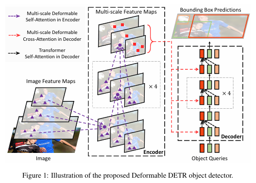
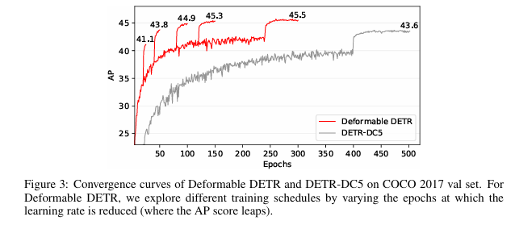

# Deformable DETR for PyTorch

## 简介

- 论文原作者：Xizhou Zhu, Weijie Su, Lewei Lu, Bin Li, Xiaogang Wang, Jifeng Dai.

- 论文名称： Deformable DETR: Deformable Transformers for End-to-End Object Detection.

- Deformable DETR 是一个高效的收敛快的端到端目标检测器（Object Detector）；它通过一种新颖的基于采样的注意力机制解决了DETR模型的高复杂性和收敛慢的问题；





- 原始代码仓库：https://github.com/fundamentalvision/Deformable-DETR
- commit id：11169a60c33333af00a4849f1808023eba96a931
- 昇腾适配代码仓库：https://gitee.com/ascend/DrivingSDK/tree/master/model_examples/Deformable-DETR

## 支持的任务列表

| 模型            | 任务列表       | 精度     | Backbone | 是否支持  |
| --------------- | -------------- | -------- | -------- | --------- |
| Deformable DETR | 训练目标检测器 | FP32精度 | ResNet50 | $\sqrt{}$ |

## 环境准备

- 当前模型支持的 PyTorch 版本：`PyTorch 2.1`

- 搭建 PyTorch 环境参考：https://gitee.com/link?target=https%3A%2F%2Fwww.hiascend.com%2Fdocument%2Fdetail%2Fzh%2FModelZoo%2Fpytorchframework%2Fptes

**表1** 昇腾软件版本支持列表

| 软件类型 | 支持列表 |
| ------- | ------- |
| FrameworkPTAdapter | 6.0.0 |
| CANN | 8.0.0 |

1、激活 CANN 包环境：将 CANN 包所在目录记为 cann_root_dir，执行以下命令以激活环境：
```
source {cann_root_dir}/set_env.sh
```

2、创建 conda 环境并激活：
```
conda create -n deformable_detr python=3.9
conda activate deformable_detr
```

3、克隆代码仓到当前目录并使用 patch 文件
```
git clone https://gitee.com/ascend/DrivingSDK.git -b master
cd DrivingSDK/model_examples/Deformable-DETR
pip install -r requirements.txt
chmod -R 777 run.sh
./run.sh
cp -rf test Deformable-DETR
cd Deformable-DETR
```
如果需要将 Deformable-DETR 源码 clone 到用户自定义目录，执行下面的shell命令：
```
your_path=/home/    # 替换为用户自定义目标目录地址
git clone https://gitee.com/ascend/DrivingSDK.git -b master
cd DrivingSDK/model_examples/Deformable-DETR
pip install -r requirements.txt
chmod -R 777 run.sh
git clone https://github.com/fundamentalvision/Deformable-DETR.git ${your_path}
cp -f Deformable-DETR_npu.patch ${your_path}
cp -rf test ${your_path}
cd ${your_path}
git apply Deformable-DETR_npu.patch
```
## 准备数据集

进入 [COCO](https://gitee.com/link?target=http%3A%2F%2Fcocodataset.org%2F%23download) 官网，下载 COCO2017 数据集。将数据集上传到服务器任意路径下并解压，数据集结构排布成如下格式：

```shell
coco_path/
  annotations/  # annotation json files
  train2017/    # train images
  val2017/      # val images
```

## 快速开始

### 模型训练：

主要提供单机 8 卡训练脚本：

- 在模型根目录下运行训练脚本

```shell
bash test/train_8p_full.sh --data_path='.data/coco'		# 替换成你的coco数据集路径，进行 8 卡训练
bash test/train_8p_performance.sh --data_path='.data/coco'		# 替换成你的coco数据集路径，进行 8 卡性能测试
```

训练脚本参数说明：

```shell
--data_path    # 数据集路径，必填
--epochs       # 重复训练次数，可选项，默认 50
```

### 训练结果：

| 芯片          | 卡数 | epoch | mAP(IoU=0.50:0.95) | FPS  |
| ------------- | ---- | ----- | ------------------ | ---- |
| 竞品A         | 8p   | 50    | 0.437              | 65   |
| Atlas 800T A2 | 8p   | 50    | 0.436              | 36   |

## 变更说明

2024.12.23：首次发布

## FQA

暂无